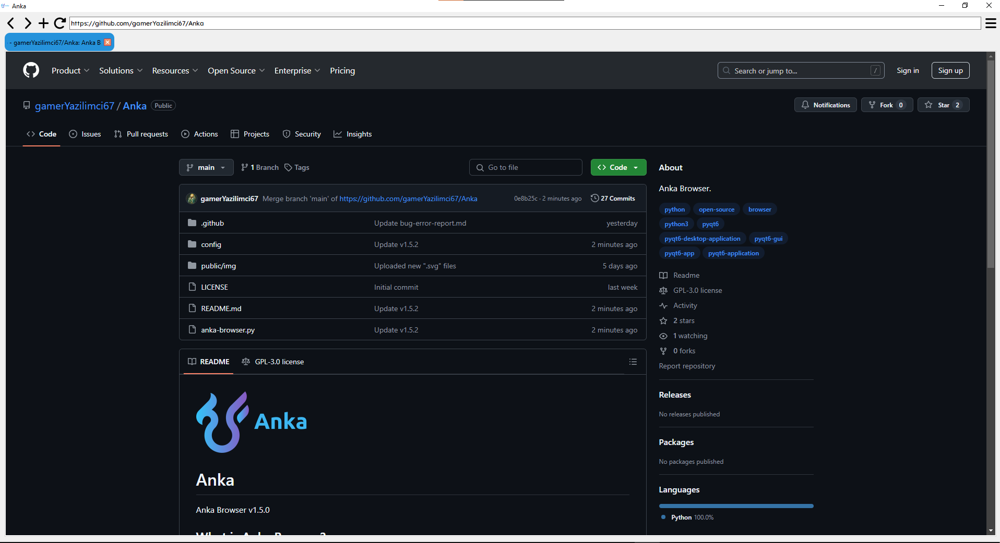
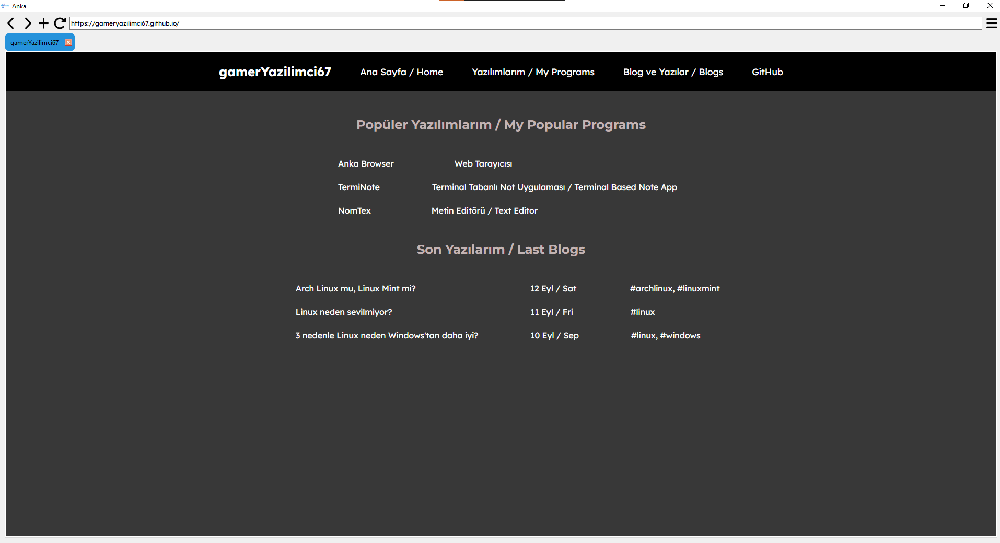

# Anka

Anka Browser v1.5.0

## What is Anka Browser?

Anka is a browser developed with PyQt6 and QWebEngine in Python and open-source browser.

## Anka v1.5.2:

- ### Reload Button:
  Now, you can reload the page with reload button on top on page.
- ### ``config.conf`` and Settings:
  You can edit your settings by clicking on the Settings button in the top right hand corner. However, this feature is currently in beta and you can only change your search engine. The way it works is that changing the settings changes the ``config/config.conf`` file and DO NOT DELETE THIS FILE because the main code gets the search engine address from this configuration file. And the ``configparser`` library has been added so that Python can parse this configuration file.
- ### Customize the Tab Colors:
  Now, you can customize tab colors with Color Dialog(QColorDialog).

## What is the next update?
***Next update includes:***

- More settings and more configurations
- More search engine(Startpage, Brave and oth.)
- History 
- Downloads

## Screenshots from Anka Browser:

## Imported libraries in project:

- PyQt6
- sys
- configparser

## Warnings:
> This project is using "GNU GENERAL PUBLIC LICENSE"!
