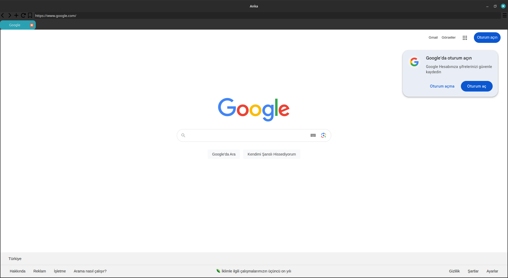
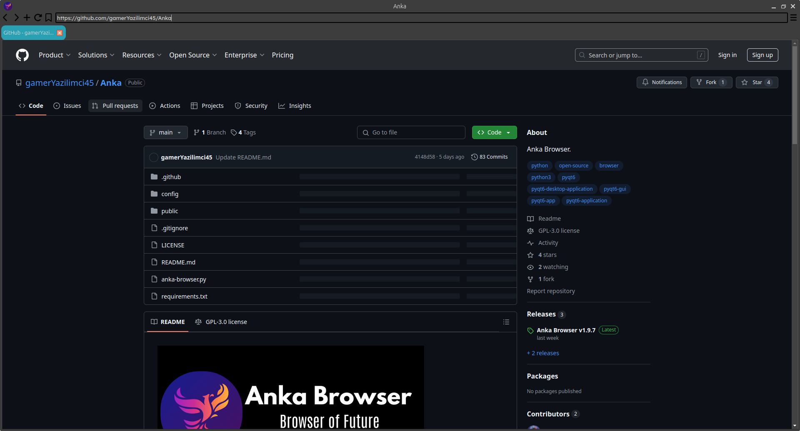

# Anka

Anka Browser v1.9 Beta

## What is Anka Browser?

Anka is a browser developed with PyQt6 and QWebEngine in Python and open-source browser.

You can download and use Anka Browser in every Python installed device.

---

## Anka v1.9 Beta:

- ### Bookmarks Beta:
  Now, bookmars added. But beta version.
  

- ### Languages:
  Now, Anka Browser is support two language. Türkçe(Turkish) and English. You can find English version from
  ``/src/en-En/`` and you can find Türkçe(Turkish) version from ``/src/tr-TR/``

- ### History update:
  Your search history is save to /public/browser/history.txt. If you want delete history, you can delete from "Delete History" button from Settings.
 
- ### PNG buttons:
  Now, buttons' icons have ``.png`` extension. Not ``.svg``

- ### Light&Dark Theme:
  If you use Linux, and your system theme is light, Anka Browser theme is light or your system theme is dark, Anka Browser theme is dark.

- ### Browser Files Control:
  If ``config/config.conf`` file or ``public/browser/history.txt`` file is deleted or not finded, Anka Browser create them with default variables.

- ### Default Tab Color:
  Now, default tab color is #2aa1b3 with HEX.

- ### Layout Update:
  Now, main layout's margins 0.

---

## Screenshots from Anka Browser:

## Imported Python libraries in project:

- PyQt6
- sys
- os
- configparser

## How I download an execute the code?
 ### Download and Install Python:
   If you use Windows, please install the Python from https://python.org/downloads

   Or if you use Linux:
    
    - If you use Debian-Ubuntu based systems: ``sudo apt install python``
    - If you use Arch based systems: ``sudo pacman -S python``
    - If you use RedHat based systems: ``sudo dnf install python3``
 ### Install the libraries:
   We succesfully complete the Python install. Let's download the libraries:
     
    pip --upgrade
    pip install pyqt6 sys os configparser
 ### End:
   If you successfully complete them, please read the "How I compile the code?"
   

## How I compile the code?
  ### English Version:
  Download the source code(if you want, don't download /src/tr-TR folder). And change directory to folder you download source code and write this commands to terminal:
    
  1. ``cd Anka``

  2. ``cd src``

  3. ``cd en-EN``

  4. ``python3 anka-browser.py``

  ### Türkçe Versiyon(Turkish Version):
  Kaynak kodunu indirin, isterseniz ingilizce kaynak kodu indirmeyebilirsiniz. Kaynak kodunu
  indirdiğiniz klasöre geçin ve şu kodları terminale yazın:

  1. ``cd Anka``

  2. ``cd src``

  3. ``cd tr-TR``

  4. ``python3 anka-browser.py``

## Warnings:
> This project is using "GNU GENERAL PUBLIC LICENSE"!
