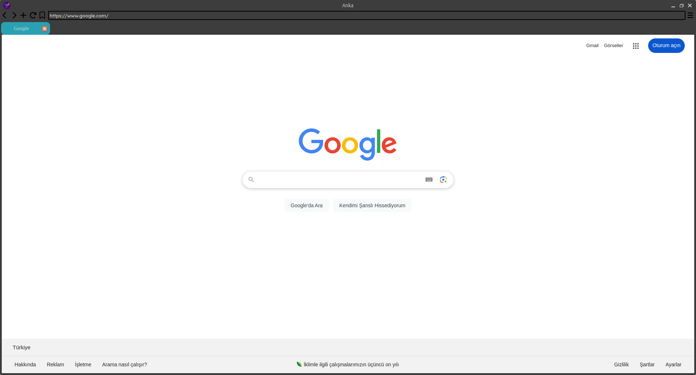

# Anka

Anka Browser v1.7.3

## What is Anka Browser?

Anka is a browser developed with PyQt6 and QWebEngine in Python and open-source browser.

You can download Anka Browser in every Python installed device.

## Anka v1.7.3:

- ### Customize the Tab Colors:
  Now, you can customize tab colors with Color Dialog(QColorDialog).

- ### Added more search engines:
  Microsoft Bing, Brave Search and Startpage search engines added.

- ### URL Bar update:
  Now, if you don't write URL to URL bar, Anka Browser is searchs text to your write on your search engine.

- ### History update:
  Your search history is save to /public/browser/history.txt. If you want, you can delete from "Delete History" button from Settings.
 
- ### PNG buttons:
  Now, buttons' icons have ``.png`` extension. Not ``.svg``

- ### Light&Dark Theme:
  If you use Linux, and your system theme is light, Anka Browser theme is light or your system theme is dark, Anka Browser theme is dark.

- ### Browser Files Control:
  If ``config/config.conf`` file or ``public/browser/history.txt`` file is doesn't exit&deleted , Anka Browser create them with default variables.

- ### Default Tab Color:
  Now, default tab color is #2aa1b3 with HEX.

- ### Layout Update:
  Now, main layout's margins 0.

## What is the next update?
***Next update includes:***

- Downloads
- Will be add

## Screenshots from Anka Browser:

## Imported libraries in project:

- PyQt6
- sys
- configparser

## Warnings:
> This project is using "GNU GENERAL PUBLIC LICENSE"!
